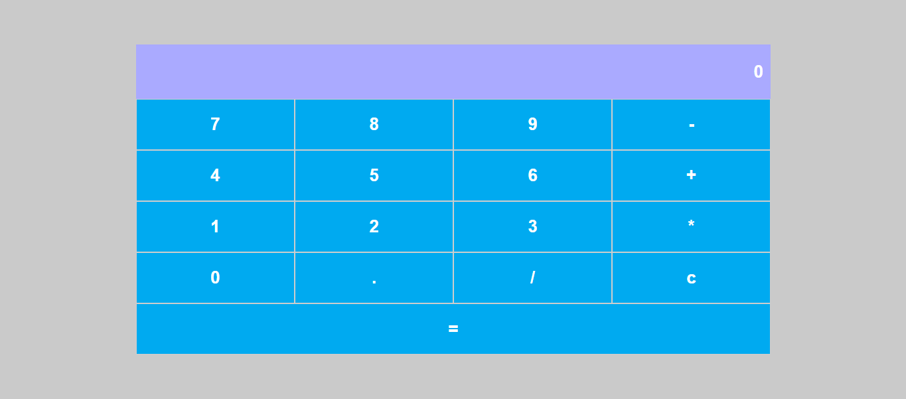

# 🧮 Calculadora Aritmética  

Aplicação React de calculadora básica, que permite realizar operações matemáticas simples: soma, subtração, multiplicação e divisão.

<div align="center">
  
</div>

## ✨ Funcionalidades

- **Inserção de números**: Suporta números e ponto decimal.
- **Operações básicas**: Soma, subtração, multiplicação e divisão.
- **Limpar**: Reseta o visor e os valores.
- **Resultado**: Exibe o cálculo final conforme a operação.

## 🛠 Tecnologias Usadas

- [React](https://conf.react.dev/)
- [Styled-components](https://styled-components.com/)

## ⚙️ Instalação

Para executar este projeto localmente, siga os seguintes passos:

1. Clone o repositório:
    ```bash
    git clone https://github.com/JosielJrr/react-calculator-app.git
    cd react-calculator-app
    ```
2. Instale as dependências:
    ```bash
    npm install
    ```
3. Inicie o servidor:
    ```bash
    npm start
    ```

> Este projeto foi desenvolvido como parte da **Formação React Developer da [Digital Innovation One](https://www.dio.me/)**.
